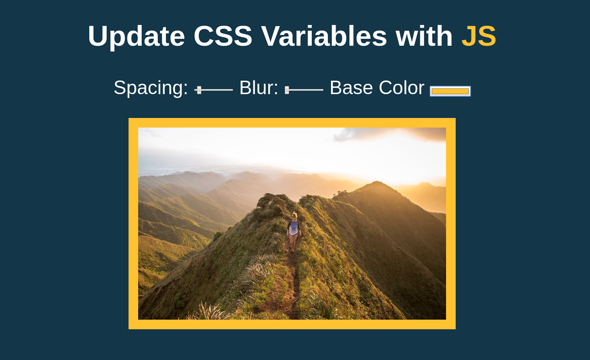

# Playing With CSS Variables in JavaScript
Project 3 of Wes Boss's Javascript 30

This project was a fun way to learn how CSS variables can be manipulated with JavaScript to allow inputs to directly effect the style. Can see myself using this in the future.

